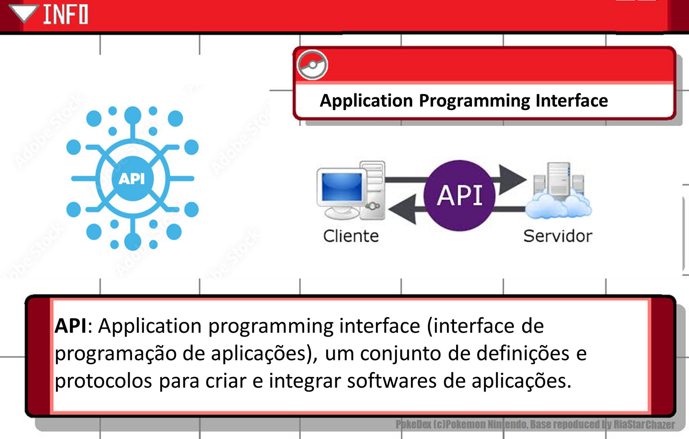
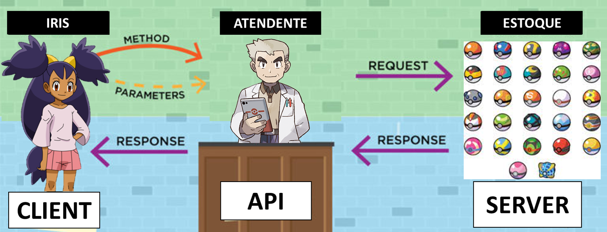
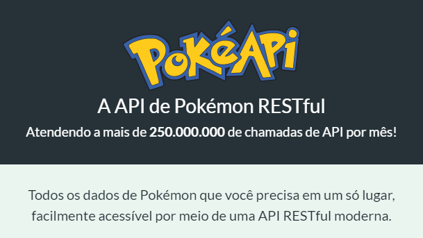
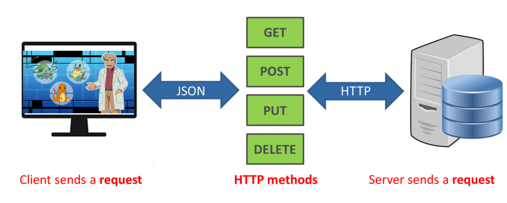
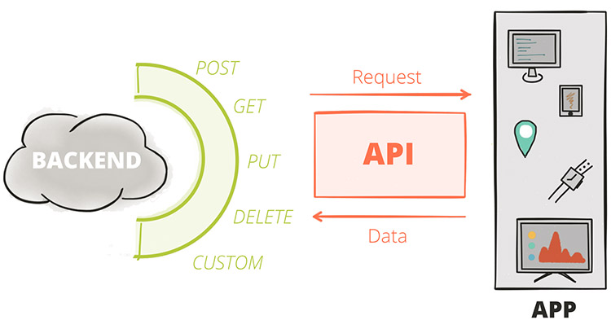
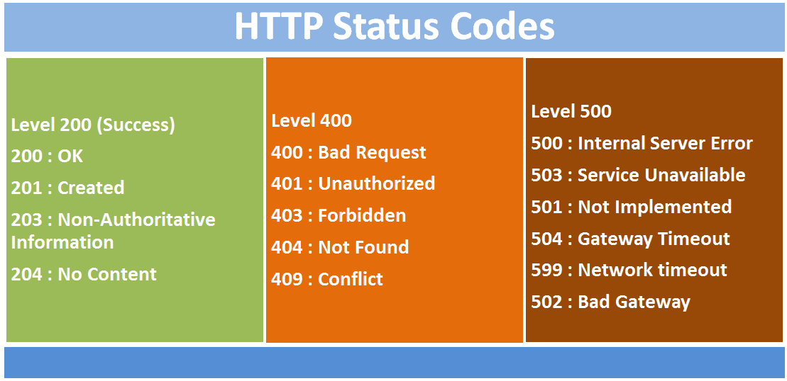
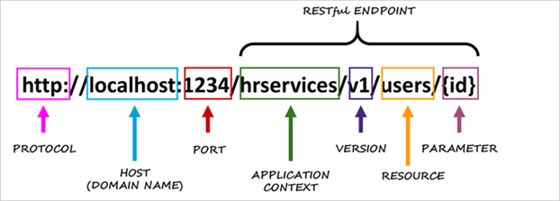

# O que é API? Rest e Restful?

>
Getting Started #14 - [DIO.me](https://www.youtube.com/watch?v=68W5nx8yQZU)

# 📌 Preparando-se para uma nova aventura

1. [O que é API?](#o-que-é-api)
2. [Como as APIs funcionam?](#como-as-apis-funcionam)
3. [Exemplos de API](#exemplos-de-api)
4. [API REST](#rest-representational-state-transfer)
5. [API RESTFUL](#restful)

## 💥 Que problemão

> 

> Para enfrentar o seu rival no grande torneio, Iris precisa capturar novos Pokémon, mas para isso vai precisar de comprar alguns recursos.

🟣 Solicitar pokebolas especializadas

🟣 Comprar ração Pokémon

> 

Iris ouviu falar que tem uma app que se comunica através de API e que ela pode comprar essas coisas, MAS QUE RAIOS É UMA API?

## O que é API?
> API - Application Programming Interface (interface de programação de aplicações), um conjunto de definições e protocolos para criar e integrar softwares de aplicações.

> 

## Como as APIs funcionam?

> 

Podemos pensar na utilidade do que é API por dois pontos de vista: **como produtor ou consumidor**.

Quando você produz, você está criando APIs para que outras aplicações ou sistemas possam se integrar ao seu sistema. Isso não significa que você irá criar uma API apenas para expor seu sistema a terceiros.

Vai depender do seu propósito, mas a API também pode ser apenas para seu uso, como de uma interface sua para os clientes.

Seguindo nessa linha de raciocínio, imagine que você possua um sistema de comércio. Ao criar uma API de acesso ao seu sistema, você possibilita a oferta de seus produtos nas interfaces de seu interesse.

**O que você vai expor de seu sistema na API depende do que deseja oferecer como funcionalidade**, mas poderia, por exemplo:

- listar produtos;
- ofertar promoções;
- efetivar vendas;
- realizar cobrança do pedido.

## Exemplos de API

Até aqui, exploramos o que é API e as possibilidades de você criar a API para facilitar a integração com aplicações.

No entanto, hoje em dia já possuímos uma quantidade enormes de APIs que podemos utilizar para enriquecer nossas aplicações, e são de todos os tipos. Vou citar apenas algumas para ilustrar a gama de serviços e funcionalidades já existentes para integração entre sistemas.

> 

### PokéApi

Esta é uma API RESTful completa vinculada a um extenso banco de dados detalhando tudo sobre a série principal de jogos Pokémon.

Essa API sempre estará disponível publicamente e nunca exigirá nenhum processo de configuração extenso para consumir.

Documentação [PokéApi](https://pokeapi.co/docs/v2).

### **Pagamentos**

Como exemplos de sistemas que oferecem [APIs para pagamentos](https://gerencianet.com.br/blog/api-de-pagamento-entenda-o-que-e/), temos:

- PagSeguro;
- Paypal;
- Iugu;
- Gerencianet;
- Cielo.

Todos eles vão oferecer uma infinidade de formas de pagamentos para sua aplicação.

### **Redes sociais**

Uma vasta quantidade de redes sociais também oferecem exemplos de APIs que podemos utilizar para enriquecer a experiência dos usuários em nossas aplicações. Algumas deles são:

- Facebook;
- Twitter;
- Instagram.

Essas APIs oferecem funcionalidades diversas, como:

- obter informações úteis sobre o usuário;
- criar opção de login utilizando o perfil da rede social, entre outras.

### **Localização**

Uma das APIs mais populares quando falamos de localização é a do **Google Maps**. APIs do tipo irão possibilitar que sejam oferecidos serviços e informações para o usuário de acordo com sua localização, trazendo uma experiência muito mais rica.

### **Comércio eletrônico**

Exemplos de APIs desse tipo possibilitam integrar com sistemas e ampliar a oferta de produtos para venda, assim como fazer acompanhamento de compras realizadas. Algumas plataformas que oferecem APIs nesse sentido são:

- Mercado Livre;
- eBay.

Esses são somente alguns exemplos de APIs, mas as possibilidades de integrações são enormes.

## REST (Representational state transfer)

**REST:** Trata-se de um conjunto de requisições que permite a comunicação de dados entre aplicações. Para isso, a API utiliza requisições [HTTP](https://rockcontent.com/br/blog/http/) responsáveis pelas operações básicas necessárias para a manipulação dos dados. As principais requisições são:

> 

- **POST:** criar dados no servidor;
- **GET:** leitura de dados no [host](https://rockcontent.com/br/blog/host/);
- **DELETE:** excluir as informações;
- **PUT:** atualizações de registros.

## Restful
Os principais critérios para uma API ser **RESTful** são:

- **Stateless**: Toda requisição é feita por completo e não salva nenhum estado ou referência na memória sobre transações antigas são armazenadas, e cada uma delas é feita do zero.

- **Uniform Interface:**  Define e respeita uma comunicação sempre uniforme (padronizada) para comunicação do cliente e servidor utilizando sempre:

	- verbos HTTP (GET, PUT, POST, DELETES)

	> 

	- Status HTTP

	> 

	- URIs (resource name)

	> 

- **Client -Server:** O cliente e o servidor precisam estar separados, criando uma portabilidade no sistema, ou seja, o servidor pode servir um ou mais clientes.

- **Cacheable**: As respostas para uma requisição, deverão ser explícitas ao dizer se aquela requisição, pode ou não ser cacheada pelo cliente.

- **Layered system**: O Cliente vai sempre acessar um endpoint, sem precisar acessar camadas mais profundas que contenham complexidade.

- **Code on demand:** Possibilidade que nossa aplicação envie códigos (como Javascript) e execute isso no lado do cliente.

**Fim**

[>> Voltar ao topo >>](#o-que-é-api-rest-e-restful)