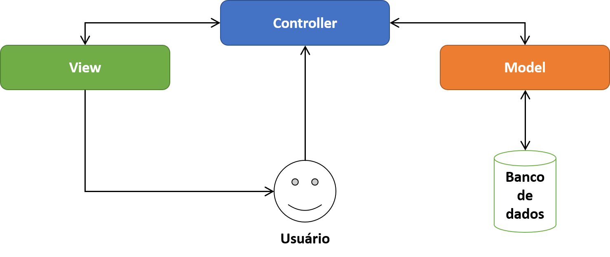

# MVC

O MVC é uma sigla do termo em inglês `Model (modelo)` `View (visão)` e `Controller (Controle)` que facilita a troca de informações entre a interface do usuário aos dados no banco, fazendo com que as respostas sejam mais rápidas e dinâmicas.

> É um padrão de arquitetura de software responsável por contribuir na otimização da velocidade entre as requisições feitas pelo comando dos usuários.

## Quais os papéis de cada camada?

Quando falamos sobre o MVC, cada uma das camadas apresenta geralmente as seguintes responsabilidades:

- **Model**: A responsabilidade dos models é representar o negócio. Também é responsável pelo acesso e manipulação dos dados na sua aplicação.

- **View**: A view é responsável pela interface que será apresentada, mostrando as informações do model para o usuário.

- **Controller**: É a camada de controle, responsável por ligar o model e a view, fazendo com que os models possam

> 

## Model ou Modelo 

Essa classe também é conhecida como Business Object Model (objeto modelo de negócio). **Sua responsabilidade é gerenciar e controlar a forma como os dados se comportam por meio das funções, lógica e regras de negócios estabelecidas**. 

Ele é o detentor dos dados que recebe as informações do Controller, válida se ela está correta ou não e envia a resposta mais adequada.

## Controller ou Controlador

**A camada de controle é responsável por intermediar as requisições enviadas pelo View com as respostas fornecidas pelo Model**, processando os dados que o usuário informou e repassando para outras camadas. 

Numa analogia bem simplista, o controller  operaria como o ‘’maestro de uma orquestra’’  que permite a comunicação entre o detentor dos dados e a pessoa com vários questionamentos no MVC. 

## View ou Visão

**Essa camada é responsável por apresentar as informações de forma visual ao usuário**. Em seu desenvolvimento devem ser aplicados apenas recursos ligados a aparência como mensagens, botões ou telas. 

Seguindo nosso processo de comparação o View está na linha de frente da comunicação com usuário e é responsável transmitir questionamentos ao controller e entregar as respostas obtidas ao usuário. É a parte da interface que se comunica, disponibilizando e capturando todas as informação do usuário.

## Como os componentes interagem?

Tudo começa com a interação do usuário na camada View. A partir daí o controlador pega essa informações e envia para o Model que fica responsável por avaliar aqueles dados e transmitir uma resposta. 

O controlador recebe essas respostas e envia uma notificação de validação daquela informação para a camada visão, fazendo com a mesma apresente o resultado de maneira gráfica e visual.

Todo esse processo leva em consideração as regras de negócio aplicadas na construção de todo projeto.

## Por que usar MVC?

Muitos [bootcamps de programação](https://www.lewagon.com/pt-BR/blog/bootcamps-programa%C3%A7%C3%A3o-funcionam) ensinam esse padrão de arquitetura de software por alguns benefícios que justificam o MVC como uma das mais escolhidas no processo de desenvolvimento. Esses benefícios são:

- **Segurança**: O controller funciona como uma espécie de filtro capaz de impedir que qualquer dado incorreto chegue até a camada modelo.

- **Organização**: Esse método de programação permite que um novo desenvolvedor tenha muito mais facilidade em entender o que foi construído, assim como os erros se tornam mais fácil de serem encontrados e corrigidos.

- **Eficiência**: Como a arquitetura de software é dividida em 3 componentes , sua aplicação fica muito mais leve, permitindo que vários desenvolvedores trabalhem no projeto de forma independente.

- **Tempo**: Com a dinâmica facilitada pela colaboração entre os profissionais de desenvolvimento, o projeto pode ser concluído com muito mais rapidez, tornando o projeto escalável.  

- **Transformação**: As mudanças que forem necessárias também são mais fluidas, já que não será essencial trabalhar nas regras de negócio e correção de bugs.

Além disso, um software precisa ter estabilidade no processo de comunicação entre seus elementos de maneira dinâmica para que a experiência do usuário não seja prejudicada.

## Exemplos da importância do MVC

Não dá para falar do MVC sem citar a importância que ele traz em meio ao desenvolvimento de software.

Uma dessas vantagens é que ele nos ajuda a deixar o código mais manutenível, ou seja, mais fácil de fazer manutenção, já que temos as responsabilidades devidamente separadas. Isso também traz uma facilidade na compreensão do código, além da sua reutilização.

> EXEMPLO 01:
> Além disso, você tem um código mais testável, pois ele é mais granular: se você tem uma aplicação onde, por exemplo, na página de listagem de usuários, o nome do usuário está sendo cortado ou não está sendo exibido da maneira correta, é muito mais fácil você fazer um teste que atinja somente as estruturas de views.

Aqui, podemos ver claramente que você tem um problema de apresentação: os models não são responsáveis por aspectos de apresentação, assim como os controllers também não são… Veja que é até mais fácil de identificar que o problema está na view. Por isso, você consegue corrigir somente a view e testá-la de maneira isolada.

>EXEMPLO 2:
> Um segundo exemplo seria se você tivesse um problema de validação ou uma informação de um campo que o usuário está preenchendo na view e não está chegando no banco de dados: não é a view que envia coisas para o banco de dados, assim como também não é o model que é responsável por esse papel (aliás, o model pode até enviar coisas para o banco de dados, mas essas informações são repassadas por outras estruturas anteriores).

Então, podemos chegar à conclusão de que o problema é no controller. Sendo assim, você consegue trabalhar somente no controller, sabendo que as alterações provavelmente não irão impactar nas views e nos models. Além disso, você conseguirá realizar testes de uma maneira muito mais rápida e eficiente.

## Conclusão
O MVC funciona como um padrão de arquitetura de software que melhora a conexão entre as camadas de dados, lógica de negócio e interação com usuário. Através da sua divisão em três componentes, o processo de programação se torna algo mais simples e dinâmico.

Por padrão existem a camada `Model`, `Controller` e `View` que deram origem a sigla dessa arquitetura de software mais utilizado entre os desenvolvedores.  

Algumas empresas podem até cobrar o conhecimento de determinados frameworks para sua aplicação no dia-a-dia, por isso é interessante que o candidato participe de bootcamps que explorem o assunto de maneira adequada, a fim de melhorar a [curva de aprendizado](https://www.lewagon.com/pt-BR/blog/aprender-programacao-do-zero-por-onde-comecar) de quem quer explorar a área. 